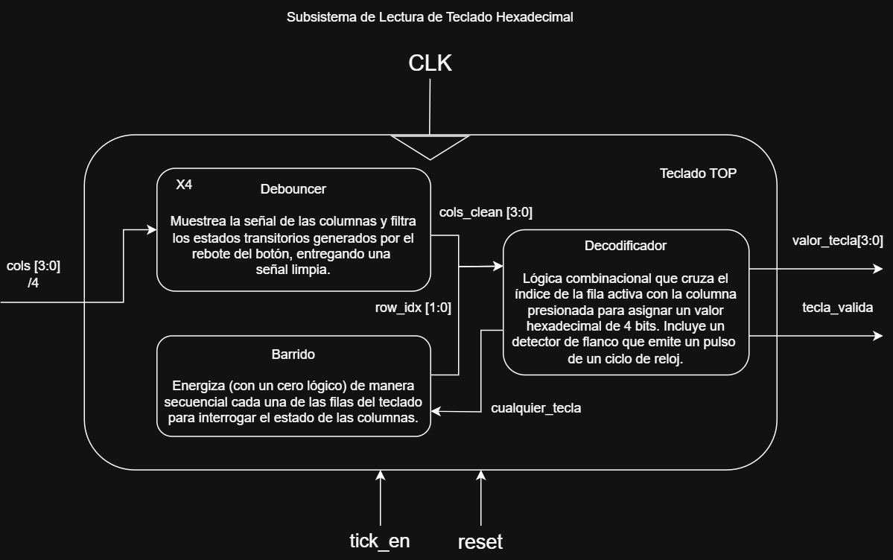
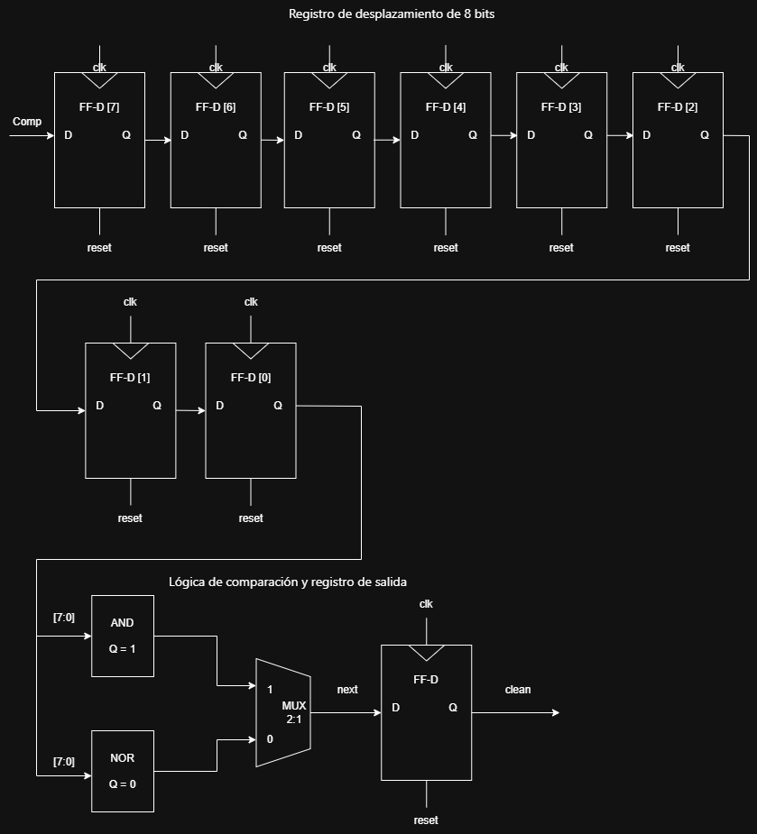
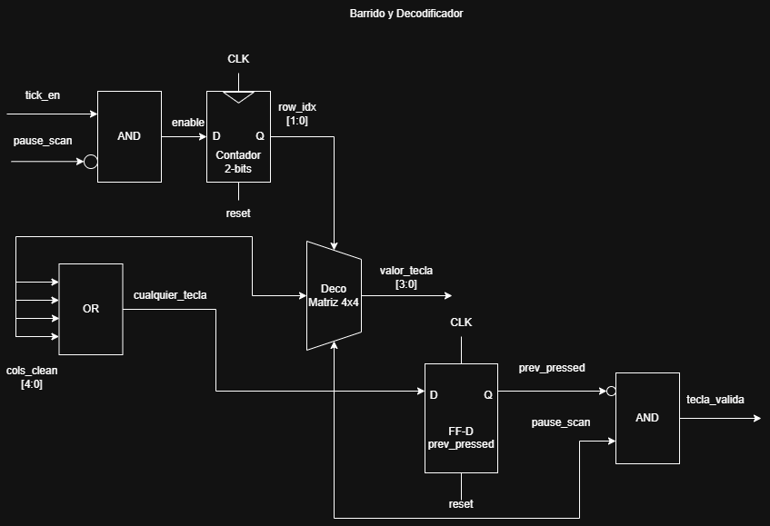
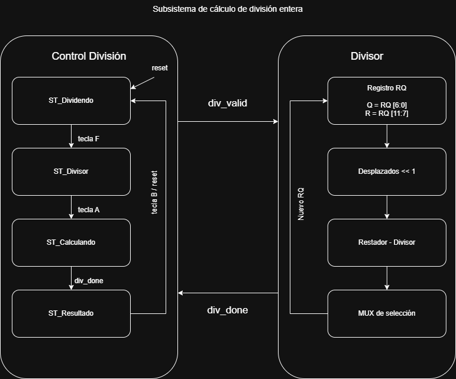
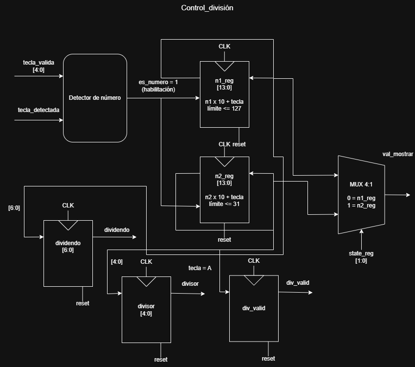
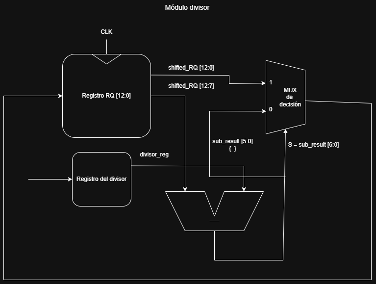
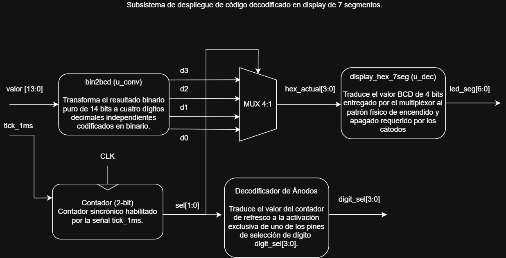

# Proyecto III - División en HDL

**Escuela de Ingeniería Electrónica** **EL-3307 Diseño Lógico** **I Semestre 2026**

---
## 1. Abreviaturas y definiciones
* FPGA: Field Programmable Gate Arrays
* FSM: Finite State Machine
* BCD: Binary Coded Decimal

## 2. Introducción
El diseño de sistemas digitales requiere habilidad de implementación de algoritmos por medio de circuitos lógicos. Muchos algoritmos en la práctica usan iteraciones, segmentación (pipelining) o bucles que a la hora de traducirlos a implementaciones de lógica booleana, surge la necesidad de un control lógico que habilite el
correcto flujo de datos en circuito. Asimismo, las interfaces de bloque a bloque se diseñan con protocolos de bus para ayudar a estandarizar la comunicación entre unidades. Estos protocolos de bus facilitan las pruebas unitarias sobre bloques porque toda unidad se puede controlar de una manera similar.

El proyecto consiste en diseñar e implementar en una FPGA (TangNano 9K) una unidad de división de enteros sin signo, usando SystemVerilog. La unidad toma un dividendo de hasta 7 bits (máximo 127) y un divisor de hasta 5 bits (máximo 31), y entrega el cociente y el residuo. El sistema se divide en cuatro subsistemas encadenados: lectura de datos; cálculo de la división; conversión binario a BCD; y despliegue en 7 segmentos.

## 3. Definición del problema, Objetivos y Especificaciones
### 3.1 Definición del problema 
En el diseño de sistemas digitales, la implementación de operaciones aritméticas complejas como la división entera representa un reto significativo, dado que, a diferencia de una suma, no existe una solución combinacional trivial de bajo costo. Se requiere desarrollar un circuito que capture manualmente un dividendo y un divisor en formato decimal desde un teclado hexadecimal, ejecute el algoritmo de división entera sin signo mediante una arquitectura con pipeline, y visualice tanto el cociente como el residuo en un display de 7 segmentos, garantizando la correcta sincronización entre subsistemas mediante señales de control y el manejo adecuado de ruido mecánico en las entradas.

### 3.2 Objetivos
* Objetivo General: Introducir al estudiante a la implementación de algoritmos por medio de máquinas de estados complejas
* Objetivos específicos:
  1. Elaborar una implementación de un diseño digital en una FPGA.
  2. Construir un testbench básico para validar las especificaciones del diseño.
  3. Implementar un algoritmo de división de enteros con una Máquina de estados con técnicas avanzadas.
  4. Coordinación de trabajo en equipo mediante el uso de herramientas de control de versiones.
  5. Practicar planificación de tareas para trabajo de grupo

### 3.3 Especificaciones 
* Frecuencia de reloj: El sistema debe operar exclusivamente a la frecuencia de 27 MHz provista por la TangNano 9K. Solo se permite un único reloj en todo el diseño; las bases de tiempo más lentas deben derivarse mediante divisores de frecuencia.
Lenguaje de descripción: SystemVerilog, siguiendo la metodología y estilo de codificación definidos en el curso, incluyendo el formato estipulado para máquinas de estados finitos (FSM).
* Sincronización: Todas las entradas externas deben registrarse y pasar por un proceso de debouncing para evitar metaestabilidad y rebotes mecánicos.
Capacidad de datos: Soporte para un dividendo decimal de hasta 3 dígitos (máximo 127, representable en 7 bits) y un divisor decimal de 2 dígito (máximo 31, representable en 5 bits).
* Algoritmo de división: Implementación del algoritmo iterativo de división por desplazamiento y resta sucesiva descrito en el material "Digital Design and Computer Architecture: ARM Edition" de Harris & Harris, sección 5.2.7. El algoritmo es controlado mediante una máquina de estados finitos y ejecuta una iteración por ciclo de reloj hasta obtener el cociente y el residuo finales.
* Señales de control entre subsistemas: El subsistema de lectura debe emitir una bandera valid al subsistema de cálculo cuando los operandos sean estables; el subsistema de cálculo debe emitir una bandera done al subsistema de despliegue cuando el resultado sea estable.
* Visualización: Despliegue del cociente o residuo en display de 7 segmentos, con selección entre ambos resultados mediante una tecla del teclado o botón dedicado. El manejo de los displays debe realizarse a través de transistores, no directamente desde los pines de la FPGA.
* Conversión de formato: El resultado binario debe convertirse a BCD antes del despliegue, utilizando el subsistema desarrollado en el proyecto corto II.

 ## 4. Desarrollo
 ### 4.1 Descripción general del funcionamiento 
El circuito diseñado constituye una unidad de división entera sincrónica para números decimales sin signo, implementada sobre la arquitectura de la FPGA Tang Nano 9K. El sistema opera bajo un esquema de jerarquía modular, donde un reloj de 27 MHz sincroniza tanto los periféricos de baja velocidad como la lógica aritmética interna. El flujo de datos se inicia con la captura de un dividendo y un divisor desde un teclado hexadecimal matricial, los cuales son procesados y convertidos a su representación binaria. Una vez que el subsistema de lectura valida los operandos mediante la bandera valid, el subsistema de cálculo ejecuta el algoritmo iterativo de división entera controlado por una máquina de estados finitos. Durante cada iteración se realizan operaciones de desplazamiento y resta sucesiva sobre un registro combinado que almacena el residuo parcial y el cociente en formación. Al concluir el proceso, el módulo genera la bandera done indicando que el resultado es estable. Finalmente, el cociente o residuo resultante es convertido a formato BCD para su despliegue dinámico en los displays de 7 segmentos, con posibilidad de seleccionar entre ambos resultados mediante una entrada dedicada.

### 4.2 Descripción de cada subsistema y su diagrama de bloques
1. Subsistema de Lectura: 
Este subsistema tiene la función crítica de actuar como interfaz entre los elementos analógicos/mecánicos y el núcleo digital. Su objetivo es convertir la pulsación de las teclas en un valores binarios únicos y estables.



Debido a que los contactos metálicos del teclado oscilan antes de estabilizarse, el debouncer o filtro antirrebote utiliza un registro de desplazamiento para muestrear la señal de las columnas. Solo cuando la señal se mantiene constante durante varios ciclos de tick_en, el filtro emite un valor limpio, eliminando falsos disparos. 



El barrido es un contador de anillo que genera un cero caminante en las filas del teclado. Al poner una fila en nivel bajo (0) de forma secuencial, permite identificar cuál tecla se ha cerrado al monitorear las columnas. El decodificador es el bloque de lógica combinacional que asocia la coordenada (Fila, Columna) con un valor de 4 bits (0-F). Su función fundamental es el mapeo lógico de la matriz física al lenguaje hexadecimal. Por último, el detector de flanco es el elemento que asegura que, aunque una tecla se mantenga presionada por mucho tiempo, el sistema solo registre la pulsación una vez. Genera un pulso de un solo ciclo de reloj que activa el resto de la lógica del sistema.



2. Subsistema  de cálculo de la división entera:
Este subsistema tiene la función crítica de administrar la interfaz de usuario para la captura de operandos y ejecutar de manera segura el algoritmo matemático de la división entera en hardware. Su objetivo es recibir las pulsaciones del teclado, consolidar numéricamente el dividendo A y el divisor B, procesar la operación aritmética de forma síncrona y coordinar la entrega estable de los resultados (cociente Q y residuo R) hacia la etapa de visualización.



Debido a que el usuario introduce los datos dígito por dígito en base decimal, el control de división es una FSM que acumula los valores multiplicándolos sucesivamente por 10. Para garantizar la integridad del hardware, este bloque implementa comparadores de límites dinámicos que restringen las magnitudes a un rango estricto de 7 bits para el dividendo (máximo 127) y 5 bits para el divisor (máximo 31). Una vez validados y confirmados los operandos, se inicia un protocolo de comunicación mediante la bandera div_valid para utilizar el núcleo matemático. 



El divisor es el módulo aritmético principal del subsistema y opera mediante una FSM dedicada con tres estados: `IDLE`, `SHIFT_SUB` y `DONE`. En el estado `IDLE`, el módulo espera la bandera `valid` para cargar el dividendo `A`, el divisor `B` y preparar el registro combinado `RQ`. En el estado `SHIFT_SUB`, se ejecuta el algoritmo iterativo de desplazamiento y resta sucesiva. Para ello, se desplaza el registro `RQ`, se calcula una resta tentativa entre el residuo parcial y el divisor, y se utiliza el bit de signo del resultado para decidir si el divisor cabe en el residuo temporal. Si la resta es negativa, se conserva el residuo y se inserta un `0` en el cociente; si la resta es positiva o cero, se actualiza el residuo y se inserta un `1` en el cociente. Finalmente, en el estado `DONE`, el módulo entrega el cociente `Q`, el residuo `R` y activa la bandera `done`, indicando que el resultado es estable.

El registro `RQ` posee 13 bits, distribuidos en una parte alta para el residuo parcial y una parte baja para el cociente en formación. El dividendo se carga inicialmente en los 7 bits menos significativos de `RQ`, mientras que la parte alta se inicializa en cero. El contador interno se carga con el valor 7, correspondiente a la cantidad de bits del dividendo, por lo que el algoritmo realiza una iteración por cada bit procesado. Además, el módulo incluye protección contra división entre cero: cuando el divisor `B` es igual a cero, se asigna al cociente el valor máximo representable, `127`, y el residuo se coloca en cero, activando inmediatamente la bandera `done`.



3. Subsistema de conversión de binario a representación BCD y viceversa
Este último subsistema consiste en la interfaz de salida. Este subsistema gestiona la potencia y el despliegue de la información mediante multiplexación temporal.



Dado que la operación se realiza en binario, el convertidor es fundamental para separar el número en unidades, decenas, centenas y millares (si fuera necesario). Transforma un valor de hasta 14 bits en cuatro grupos de 4 bits independientes. El contador de refresco genera un índice cíclico a una frecuencia de aproximadamente 1 kHz. Este índice determina qué posición del display se está atendiendo en cada microsegundo. El multiplexor toma los cuatro dígitos del convertidor BCD y, sincronizado con el contador de refresco, selecciona cuál dígito enviar al decodificador de segmentos. El decodificador de ánodos toma el índice del contador y activa físicamente el pin que energiza el display correspondiente. Esto asegura que el dígito de las "unidades" solo se encienda en la posición de las unidades. Por último, mediante el decodificador de segmentos, la tabla de verdad convertida a hardware traduce el número de 4 bits al patrón de encendido de los ledes necesarios para dibujar el número.

## 5. Máquinas de Estados Finitos / Finite State Machines (FSMs) implementadas
El comportamiento secuencial del sistema está bajo el control de tres Máquinas de Estados Finitas (FSM) que operan de manera concurrente para gestionar la captura, el procesamiento y la validación de los datos.

1. FSM Unidad de Control Lógico:

```systemverilog
typedef enum logic [1:0] {
    IDLE,
    SHIFT_SUB,
    DONE
} state_t;

state_t state;

always_ff @(posedge clk or posedge rst) begin
    if (rst) begin
        state       <= IDLE;
        Q           <= 7'd0;
        R           <= 5'd0;
        done        <= 1'b0;
        RQ          <= 13'd0;
        divisor_reg <= 5'd0;
        count       <= 3'd0;
    end else begin
        case (state)

            IDLE: begin
                done <= 1'b0;

                if (valid) begin
                    RQ          <= {6'd0, A};
                    divisor_reg <= B;
                    count       <= 3'd7;

                    if (B == 5'd0) begin
                        Q    <= 7'h7F;
                        R    <= 5'd0;
                        done <= 1'b1;
                    end else begin
                        state <= SHIFT_SUB;
                    end
                end
            end

            SHIFT_SUB: begin
                if (count == 0) begin
                    Q     <= RQ[6:0];
                    R     <= RQ[11:7];
                    done  <= 1'b1;
                    state <= DONE;
                end else begin
                    if (sub_result[6] == 1'b1) begin
                        RQ <= shifted_RQ;
                    end else begin
                        RQ <= {sub_result[5:0], shifted_RQ[6:1], 1'b1};
                    end

                    count <= count - 1'b1;
                end
            end

            DONE: begin
                if (!valid) begin
                    done  <= 1'b0;
                    state <= IDLE;
                end
            end

            default: begin
                state <= IDLE;
            end

        endcase
    end
end
```

Esta máquina de estados finitos controla el núcleo aritmético del divisor. En este caso la operación se realiza de manera secuencial mediante desplazamiento y resta sucesiva. La FSM administra la carga de operandos, el proceso iterativo de división y la entrega final del cociente y el residuo.

* `IDLE` (Espera y carga de operandos): Es el estado inicial del divisor. En este estado, la señal `done` se mantiene en bajo y el módulo espera la activación de la bandera `valid`. Cuando `valid = 1`, el dividendo `A` se carga en los bits menos significativos del registro combinado `RQ`, mientras que la parte superior se inicializa en cero para formar el residuo parcial inicial. Además, el divisor `B` se almacena en `divisor_reg` y el contador interno se carga con el valor 7, correspondiente a la cantidad de bits del dividendo. Si el divisor es igual a cero, el módulo no inicia el proceso iterativo; en su lugar, asigna el valor máximo representable al cociente, `Q = 127`, coloca el residuo en cero y activa inmediatamente la bandera `done`.

* `SHIFT_SUB` (Desplazamiento y resta): En este estado se ejecuta el algoritmo de división. En cada iteración, el registro `RQ` se desplaza una posición hacia la izquierda. Luego se realiza una resta tentativa entre el residuo parcial y el divisor. Si el resultado de la resta es negativo, el residuo no se actualiza y se coloca un `0` en el bit correspondiente del cociente. Si el resultado es positivo o cero, el residuo se actualiza con el resultado de la resta y se coloca un `1` en el cociente. El contador interno disminuye en cada ciclo hasta completar las iteraciones necesarias.

* `DONE` (Resultado estable): Una vez terminadas las iteraciones, el cociente final se toma de la parte baja del registro `RQ` y el residuo final de la parte alta. La bandera `done` se activa para indicar que los resultados son válidos y pueden ser enviados al subsistema de despliegue. El sistema permanece en este estado hasta que la señal `valid` vuelva a cero, momento en el cual la FSM retorna al estado `IDLE` y queda lista para una nueva operación.


2. FSM Barrido de Matriz:

```
always_ff @(posedge clk or posedge rst) begin
        if (rst) begin
            row_idx <= 2'b00;
        end else if (tick_en && !pause_scan) begin
            row_idx <= row_idx + 1'b1;
        end
    end

    always_comb begin
        case (row_idx)
            2'b00: rows_out = 4'b0001; // Fila 0 activa
            2'b01: rows_out = 4'b0010; // Fila 1 activa
            2'b10: rows_out = 4'b0100; // Fila 2 activa
            2'b11: rows_out = 4'b1000; // Fila 3 activa
            default: rows_out = 4'b0000;
        endcase
    end
```

Máquina de estados cíclica y autónoma diseñada para la exploración secuencial del teclado matricial. Posee cuatro estados correspondientes al índice lógico de las filas del teclado (2'b00, 2'b01, 2'b10, 2'b11).
En cada ciclo del reloj base (o tick de habilitación), la FSM avanza al siguiente estado, desplazando un cero lógico (0) por los pines de salida conectados a las filas.
Si el decodificador detecta un nivel lógico bajo en alguna de las columnas (indicando que una tecla fue presionada), la FSM suspende temporalmente sus transiciones de estado. Congela la fila activa para permitir que el filtro antirrebote estabilice la lectura sin perder la coordenada espacial del botón presionado.


3. FSM de Detección de Flanco Positivo:

```
always @* begin
        valor_tecla = 4'h0;
        if (cualquier_tecla) begin
            case (row_idx)
                2'b00: begin // Fila 0
                    if      (cols_clean[0]) valor_tecla = 4'h1;
                    else if (cols_clean[1]) valor_tecla = 4'h2;
                    else if (cols_clean[2]) valor_tecla = 4'h3;
                    else if (cols_clean[3]) valor_tecla = 4'hA;
                end
                2'b01: begin // Fila 1
                    if      (cols_clean[0]) valor_tecla = 4'h4;
                    else if (cols_clean[1]) valor_tecla = 4'h5;
                    else if (cols_clean[2]) valor_tecla = 4'h6;
                    else if (cols_clean[3]) valor_tecla = 4'hB;
                end
                2'b10: begin // Fila 2
                    if      (cols_clean[0]) valor_tecla = 4'h7;
                    else if (cols_clean[1]) valor_tecla = 4'h8;
                    else if (cols_clean[2]) valor_tecla = 4'h9; 
                    else if (cols_clean[3]) valor_tecla = 4'hC;
                end
                2'b11: begin // Fila 3
                    if      (cols_clean[0]) valor_tecla = 4'hE; 
                    else if (cols_clean[1]) valor_tecla = 4'h0;
                    else if (cols_clean[2]) valor_tecla = 4'hF; // #
                    else if (cols_clean[3]) valor_tecla = 4'hD;
                end
            endcase
        end
    end

    logic prev_pressed;
    always @(posedge clk or posedge rst) begin
        if (rst) begin
            prev_pressed <= 1'b0;
            tecla_valida <= 1'b0;
        end else begin
            prev_pressed <= cualquier_tecla;
            tecla_valida <= cualquier_tecla && !prev_pressed;
        end
    end
```

Una FSM más pequeña, de dos estados, que funciona como un filtro temporal que transforma el nivel lógico sostenido de una pulsación mecánica en un único pulso digital de un ciclo de reloj.
* Espera: El registro de memoria (prev_pressed) se encuentra en 0. El sistema monitorea la señal proveniente del filtro antirrebote. Al detectar un cambio a nivel alto, la salida de validación (tecla_valida) se dispara a 1 y la FSM transita al siguiente estado.
* Pulsado: El registro memoriza que la tecla ya fue procesada (prev_pressed = 1). En este estado, la señal de validación se fuerza inmediatamente a 0, previniendo múltiples lecturas accidentales del mismo dígito. El sistema permanece bloqueado en este estado hasta que el usuario libere físicamente el botón, momento en el cual transita de vuelta al estado de espera.


## 6. Simulación funcional del sistema

Para verificar la correctitud del sistema, se desarrolló un entorno de pruebas o `testbench`. En este se estimularon las entradas del módulo divisor y se monitorearon las señales internas principales, tales como el estado de la FSM, el registro combinado `RQ`, el contador de iteraciones, la señal `valid`, la bandera `done`, el cociente `Q` y el residuo `R`.

A continuación, se presenta el análisis de la simulación funcional, dividiendo la operación en las fases principales del sistema:


### 6.1 Condiciones Iniciales y Reinicio (Reset)

Al inicio de la simulación se aplica un pulso en alto a la señal `rst`. Como resultado, el sistema vuelve a su estado inicial de manera controlada. La FSM del divisor se establece en el estado `IDLE`, mientras que las salidas `Q`, `R` y `done` se limpian. De igual manera, el registro combinado `RQ`, el registro del divisor `divisor_reg` y el contador interno `count` se inicializan en cero.

Esta condición inicial garantiza que el divisor no conserve datos de operaciones anteriores y que el sistema quede listo para recibir una nueva operación cuando la señal `valid` sea activada.

### 6.2 Captura de operandos e inicio de la división

Luego del reinicio, el testbench coloca en las entradas los operandos correspondientes a la división. El dividendo se asigna a la entrada `A`, la cual posee un ancho de 7 bits, permitiendo representar valores desde 0 hasta 127. El divisor se asigna a la entrada `B`, con un ancho de 5 bits, permitiendo representar valores desde 0 hasta 31.

Una vez que ambos operandos se encuentran estables, se activa la señal `valid`. Esta bandera le indica al módulo divisor que los datos de entrada son válidos y que puede iniciar el cálculo. En el estado `IDLE`, el divisor carga el dividendo en los 7 bits menos significativos del registro combinado `RQ`, inicializando la parte superior con ceros para representar el residuo parcial inicial. Además, almacena el divisor en `divisor_reg` y carga el contador interno con el valor 7, correspondiente a la cantidad de bits del dividendo que deben ser procesados.

### 6.3 Proceso iterativo de desplazamiento y resta

Después de cargar los operandos, la FSM pasa al estado `SHIFT_SUB`. En este estado se ejecuta el algoritmo iterativo de división entera sin signo. En cada ciclo, el registro `RQ` se desplaza una posición hacia la izquierda y se realiza una resta tentativa entre el residuo parcial y el divisor almacenado en `divisor_reg`.

El resultado de esta resta se analiza mediante el bit de signo. Si la resta es negativa, significa que el divisor no cabe en el residuo parcial; por lo tanto, el registro `RQ` conserva el residuo desplazado y se inserta un `0` en el cociente. Si la resta es positiva o igual a cero, el residuo parcial se actualiza con el resultado de la resta y se inserta un `1` en el cociente.

Este proceso se repite hasta que el contador interno llega a cero, completando las iteraciones necesarias para formar el cociente y el residuo finales.

### 6.4 Finalización y validación del resultado

Cuando el contador interno llega a cero, la FSM extrae el cociente final de la parte baja del registro `RQ` y el residuo final de la parte alta. Luego activa la bandera `done`, indicando que el resultado ya es estable y puede ser utilizado por el resto del sistema, especialmente por el subsistema de conversión a BCD y despliegue en los displays de 7 segmentos.

En la simulación se observa que, al finalizar la operación, el módulo pasa al estado `DONE`. En este estado mantiene estables las salidas `Q` y `R` hasta que la señal `valid` vuelva a cero, lo cual permite preparar el divisor para una nueva operación.

### 6.5 Casos de prueba verificados

Para validar el funcionamiento del divisor, se ejecutaron diferentes casos de prueba en el `testbench`. Estos casos incluyen divisiones exactas, divisiones con residuo y casos donde el dividendo es menor que el divisor.

| Dividendo `A` | Divisor `B` | Cociente esperado `Q` | Residuo esperado `R` | Resultado |
| ------------: | ----------: | --------------------: | -------------------: | --------- |
|            63 |          15 |                     4 |                    3 | Correcto  |
|            13 |           2 |                     6 |                    1 | Correcto  |
|            10 |           5 |                     2 |                    0 | Correcto  |
|            31 |           4 |                     7 |                    3 | Correcto  |
|             7 |           7 |                     1 |                    0 | Correcto  |
|             5 |           9 |                     0 |                    5 | Correcto  |
|           127 |          31 |                     4 |                    3 | Correcto  |
|           127 |           7 |                    18 |                    1 | Correcto  |

Además, el diseño contempla el caso especial de división entre cero. Cuando `B = 0`, el módulo no inicia el proceso iterativo de división, sino que asigna directamente al cociente el valor máximo representable, `Q = 127`, y coloca el residuo en `R = 0`. Esta decisión permite representar una condición de saturación ante una operación matemáticamente indefinida.


## 7. Análisis de consumo de recursos y potencia 
Tras el proceso de síntesis y mapeo en la FPGA Tang Nano 9k, utilizando el flujo de herramientas de OSS CAD Suite, se obtuvieron los siguientes resultados para una frecuencia objetivo de 27.00 MHz:


--------------------------------------------------------------------------------------------------------------------------------------------------
## Análisis de Recursos y Síntesis

### Utilización Física del Dispositivo (Place & Route)

Esta tabla refleja el impacto del diseño sobre los bloques físicos disponibles en la FPGA. El diseño es sumamente eficiente, ocupando aproximadamente un 10% de la capacidad total del chip.

| Recurso de la FPGA | Usado | Disponible | Utilización |
| :--- | :---: | :---: | :---: |
| **SLICE** (Celdas Lógicas) | 936 | 8640 | `10.83%` |
| **IOB** (Pines de Entrada/Salida) | 22 | 274 | `8.03%` |
| **MUX2_LUT5** (Multiplexores de 5 entradas) | 96 | 4320 | `2.22%` |
| **MUX2_LUT6** (Multiplexores de 6 entradas) | 29 | 2160 | `1.34%` |
| **MUX2_LUT7** (Multiplexores de 7 entradas) | 9 | 1080 | `0.83%` |
| **MUX2_LUT8** (Multiplexores de 8 entradas) | 2 | 1056 | `0.19%` |
| **GSR** (Global Set/Reset) | 1 | 1 | `100.00%` |
| **RAMW** (Bloques de Memoria BRAM) | 0 | 270 | `0.00%` |
| **OSC / rPLL** (Relojes integrados) | 0 | 3 | `0.00%` |

### Desglose de Primitivas Lógicas (Síntesis)

Elementos individuales inferidos por el sintetizador a partir del código SystemVerilog:

| Categoría | Detalle de Componentes | Cantidad | Total |
| :--- | :--- | :---: | :---: |
| **Tablas de Búsqueda (LUTs)** | LUT1 (322), LUT2 (177), LUT3 (71), LUT4 (95) | - | **665** |
| **Registros (Flip-Flops)** | DFFC (37), DFFCE (166), DFFE (2), DFFP (1), DFFPE (14) | - | **220** |
| **Aritmética** | ALU | 137 | **137** |
| **Búferes I/O** | Entradas (7), Salidas (15) | - | **22** |

### Notas de Rendimiento
* **Memoria:** El diseño actual opera puramente con lógica combinacional y Flip-Flops distribuidos, sin requerir el uso de bloques de memoria RAM dedicados.
* **Frecuencia Máxima (fmax):** El diseño cumple holgadamente con los requisitos de tiempo de la placa base (27.00 MHz), logrando una frecuencia máxima teórica de reloj de **93.26 MHz**.


--------------------------------------------------------------------------------------------------------------------------------------------------

### 7.2 Estimación de Consumo Energético
Tomando en cuenta las características del flujo de síntesis y el reporte de recursos, el análisis energético se proyecta de la siguiente manera:
* **Potencia Estática:** Se mantiene en niveles mínimos propios de la familia GW1NR-9, dado que la mayor parte del silicio (92%) se encuentra inactiva.
* **Potencia Dinámica:** A diferencia de diseños asincrónicos, este sistema es impulsado por un Clock operando a **27.00 MHz**. Por lo tanto, existe un consumo dinámico continuo originado por el contador de barrido del teclado y la multiplexación de los displays a 1 kHz. Sin embargo, debido a la baja cantidad de lógica de conmutación (936 SLICEs), la disipación térmica y el consumo eléctrico general siguen siendo despreciables y manejables por la alimentación estándar del USB.

## 8. Reporte de velocidades máximas de reloj posibles 
El análisis de temporización estática fue generado por la herramienta de Place and Route (NextPNR) tras la síntesis del diseño y el enrutamiento lógico en la FPGA. Dado que la placa Tang Nano 9k cuenta con un oscilador de cristal integrado de 27.00 MHz, el diseño fue restringido para cumplir con este presupuesto de tiempo base.

### 8.1 Resultados del Análisis de Temporización:
* Frecuencia: 27.00 MHz
* Frecuencia Máxima Estimada (F_max): 93.26 MHz

### 8.2 Análisis de la Ruta Crítica (Critical Path)

La velocidad máxima de un diseño digital está determinada por su ruta crítica, es decir, el camino combinacional más largo entre dos elementos secuenciales. En este proyecto, la ruta crítica se encuentra principalmente dentro del módulo divisor, específicamente en la lógica asociada al algoritmo de desplazamiento y resta sucesiva.

Durante cada iteración del estado `SHIFT_SUB`, el sistema realiza un desplazamiento del registro combinado `RQ`, una resta entre el residuo parcial y el divisor almacenado, y una evaluación del signo del resultado para decidir la actualización del residuo y del cociente. Estas operaciones conforman el bloque combinacional más exigente del diseño.

Adicionalmente, el sistema incorpora módulos de conversión binario a BCD y lógica de multiplexación para el despliegue en los displays de 7 segmentos. Sin embargo, estos bloques presentan una menor profundidad lógica que el núcleo aritmético del divisor y, por tanto, no dominan la temporización global del sistema.

Dado que la frecuencia máxima estimada de 93.26 MHz es considerablemente superior a la frecuencia de operación utilizada por la placa (27.00 MHz), el diseño cumple holgadamente con los requerimientos de temporización. Esto garantiza márgenes positivos de setup y hold, permitiendo una operación estable y confiable del sistema.


## 9. Dificultades y problemas durante el trabajo
* Problema con el tiempo: Hubo dificultades para tener una distribución correcta del tiempo durante el trabajo. Se requirió planificar de mejor manera las tareas para aprovechar correctamente el tiempo disponible para realizar y entregar el proyecto.
